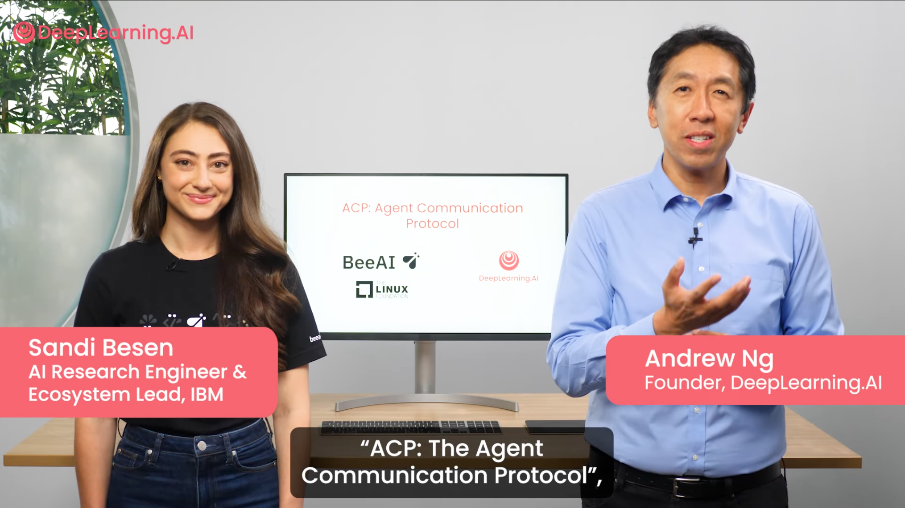

<h1 align="center">
  Agent Communication Protocol (ACP)
</h1>

<div align="center">

[](https://pypi.org/project/acp-sdk)
[](https://www.npmjs.com/package/acp-sdk)
[](https://github.com/i-am-bee/beeai-framework?tab=Apache-2.0-1-ov-file#readme)
[](https://bsky.app/profile/beeaiagents.bsky.social)
[](https://discord.gg/NradeA6ZNF)

</div>

<br>

<div align="center">

<div style="width:100%; border:2px solid #FFAA00; padding: 10px; margin: 10px 0;">

---------------------------

## 🚀 IMPORTANT UPDATE

**ACP is now part of A2A under the Linux Foundation!**  
<br>
👉 [Learn more](https://github.com/orgs/i-am-bee/discussions/5) | 🛠️ [Migration Guide](https://github.com/i-am-bee/beeai-platform/blob/main/docs/community-and-support/acp-a2a-migration-guide.mdx)

---------------------------

</div>
</div>


**ACP is an open protocol for communication between AI agents, applications, and humans.**

Modern AI agents are often built in isolation, across different frameworks, teams, and infrastructures.
This fragmentation slows innovation and makes it harder for agents to work together effectively.
ACP solves this by enabling agents to communicate and coordinate using multimodal messages.

ACP enables agents to:
- Send and receive rich messages — like text, code, files, or media
- Respond in real time, in the background, or as a stream
- Let others discover what they can do
- Collaborate on long-running tasks
- Share state with each other when needed

ACP powers agent communication on the [BeeAI Platform](https://github.com/i-am-bee/beeai-platform) — a place where you can discover, run, and share agents.

## Learn ACP

Take the hands-on introduction to ACP in this [DeepLearning.AI short course](https://www.deeplearning.ai/short-courses/acp-agent-communication-protocol/):

<div align="center">
<a href="https://www.deeplearning.ai/short-courses/acp-agent-communication-protocol/">
  
</a>
</div>

## What's New

- **🧭 [Trajectory Metadata](https://agentcommunicationprotocol.dev/core-concepts/message-metadata#trajectory-metadata)** - Enhanced MessagePart with TrajectoryMetadata for tracking multi-step reasoning and tool calling
- **🌐 [Distributed Sessions](https://agentcommunicationprotocol.dev/core-concepts/distributed-sessions)** - Session continuity across multiple server instances using URI-based resource sharing
- **🔍 [RAG LlamaIndex Agent](https://github.com/i-am-bee/acp/tree/main/examples/python/llama-index-rag)** - New example agent demonstrating Retrieval-Augmented Generation with LlamaIndex
- **📚 [Citation Metadata](https://agentcommunicationprotocol.dev/core-concepts/message-metadata#citation-metadata)** - Enhanced MessagePart with CitationMetadata for improved source tracking and attribution
- **⚡ [High Availability Support](https://agentcommunicationprotocol.dev/how-to/high-availability)** - Deploy ACP servers with centralized storage (Redis/PostgreSQL) for scalable, fault-tolerant setups
- **📝 [Message Role Parameter](https://agentcommunicationprotocol.dev/core-concepts/message-structure)** - Added `role` parameter to Message structure for better agent identification
- **🔄 [TypeScript SDK (Client)](https://github.com/i-am-bee/acp/tree/main/typescript)** - Full TypeScript client library for interacting with ACP agents

## ACP Toolkit

- **📚 [Documentation](https://agentcommunicationprotocol.dev)**. Comprehensive guides and reference material for implementing and using ACP.
- **📝 [OpenAPI Specification](https://github.com/i-am-bee/acp/blob/main/docs/spec/openapi.yaml).** Defines the REST API endpoints, request/response formats, and data models to form the ACP protocol.
- **🛠️ [Python SDK](https://github.com/i-am-bee/acp/blob/main/python).** Contains a server implementation, client libraries, and model definitions to easily create and interact with ACP agents.
- **🛠️ [TypeScript SDK](https://github.com/i-am-bee/acp/blob/main/typescript).** Contains client libraries and model definitions to easily interact with ACP agents.
- **💻 [Examples](https://github.com/i-am-bee/acp/tree/main/examples).** Ready-to-run code samples demonstrating how to build agents and clients that communicate using ACP.

## Core Concepts

| **Concept**      | **Description**  |
| ---------------- | -------------------------------------------------------------------------------------------- |
| **[Agent Manifest](https://agentcommunicationprotocol.dev/core-concepts/agent-manifest)** | A model describing an agent's capabilities—its name, description, and optional metadata and status—for discovery and composition without exposing implementation details. |
| **[Run](https://agentcommunicationprotocol.dev/core-concepts/agent-run-lifecycle)** | A single agent execution with specific inputs. Supports sync or streaming, with intermediate and final output. |
| **[Message](https://agentcommunicationprotocol.dev/core-concepts/message-structure)** | The core structure for communication, consisting of a sequence of ordered components that form a complete, structured, and multi-modal exchange of information. |
| **[MessagePart](https://agentcommunicationprotocol.dev/core-concepts/message-structure)**  | The individual content units within a `Message`, which can include types like text, image, or JSON. Together, they combine to create structured, multimodal communication. |
| **[Await](https://agentcommunicationprotocol.dev/core-concepts/agent-run-lifecycle#agent-run-await)**  | Let agents pause to request information from the client and resume, enabling interactive exchanges where the agent can wait for external input (data, actions, etc.) before continuing. |
| **[Sessions](https://agentcommunicationprotocol.dev/core-concepts/stateful-agents)**  | Enable agents to maintain state and conversation history across multiple interactions using session identifiers. The SDK automatically manages session state, allowing agents to access complete interaction history within a session. |
---

## Quickstart

> [!NOTE]
> This guide uses `uv`. See the [`uv` primer](https://agentcommunicationprotocol.dev/introduction/uv-primer) for more details.

**1. Initialize your project**

```sh
uv init --python '>=3.11' my_acp_project
cd my_acp_project
```

**2. Add the ACP SDK**

```sh
uv add acp-sdk
```

**3. Create an agent**

Let's create a simple "echo agent" that returns any message it receives.  
Create an `agent.py` file in your project directory with the following code:

```python
# agent.py
import asyncio
from collections.abc import AsyncGenerator

from acp_sdk.models import Message
from acp_sdk.server import Context, RunYield, RunYieldResume, Server

server = Server()


@server.agent()
async def echo(
    input: list[Message], context: Context
) -> AsyncGenerator[RunYield, RunYieldResume]:
    """Echoes everything"""
    for message in input:
        await asyncio.sleep(0.5)
        yield {"thought": "I should echo everything"}
        await asyncio.sleep(0.5)
        yield message


server.run()
```

**4. Start the ACP server**

```sh
uv run agent.py
```

Your server should now be running at http://localhost:8000.

**5. Verify your agent is available**

In another terminal, run the following `curl` command:

```sh
curl http://localhost:8000/agents
```

You should see a JSON response containing your `echo` agent, confirming it's available:

```json
{
  "agents": [
    { "name": "echo", "description": "Echoes everything", "metadata": {} }
  ]
}
```

**6. Run the agent via HTTP**

Run the following `curl` command:

```sh
curl -X POST http://localhost:8000/runs \
  -H "Content-Type: application/json" \
  -d '{
        "agent_name": "echo",
        "input": [
          {
            "role": "user",
            "parts": [
              {
                "content": "Howdy!",
                "content_type": "text/plain"
              }
            ]
          }
        ]
      }'
```

Your response should include the echoed message "Howdy!":

```json
{
  "run_id": "44e480d6-9a3e-4e35-8a03-faa759e19588",
  "agent_name": "echo",
  "session_id": "b30b1946-6010-4974-bd35-89a2bb0ce844",
  "status": "completed",
  "await_request": null,
  "output": [
    {
      "role": "agent/echo",
      "parts": [
        {
          "name": null,
          "content_type": "text/plain",
          "content": "Howdy!",
          "content_encoding": "plain",
          "content_url": null
        }
      ]
    }
  ],
  "error": null
}
```

**7. Build an ACP client**

Here's a simple ACP client to interact with your `echo` agent.  
Create a `client.py` file in your project directory with the following code:

```python
# client.py
import asyncio

from acp_sdk.client import Client
from acp_sdk.models import Message, MessagePart


async def example() -> None:
    async with Client(base_url="http://localhost:8000") as client:
        run = await client.run_sync(
            agent="echo",
            input=[
                Message(
                    role="user",
                    parts=[MessagePart(content="Howdy to echo from client!!", content_type="text/plain")]
                )
            ],
        )
        print(run.output)


if __name__ == "__main__":
    asyncio.run(example())
```

**8. Run the ACP client**

```sh
uv run client.py
```

You should see the echoed response printed to your console. 🎉

---

## Contributors

We are grateful for the efforts of our initial contributors, who have played a vital role in getting ACP off the ground. As we continue to grow and evolve, we invite others to join our vibrant community and contribute to our project's ongoing development. For more information, please visit the [Contribute](https://agentcommunicationprotocol.dev/about/contribute) page of our documentation.


## Maintainers

For information about maintainers, see [MAINTAINERS.md](./MAINTAINERS.md).

---

Developed by contributors to the BeeAI project, this initiative is part of the [Linux Foundation AI & Data program](https://lfaidata.foundation/projects/). Its development follows open, collaborative, and community-driven practices.
