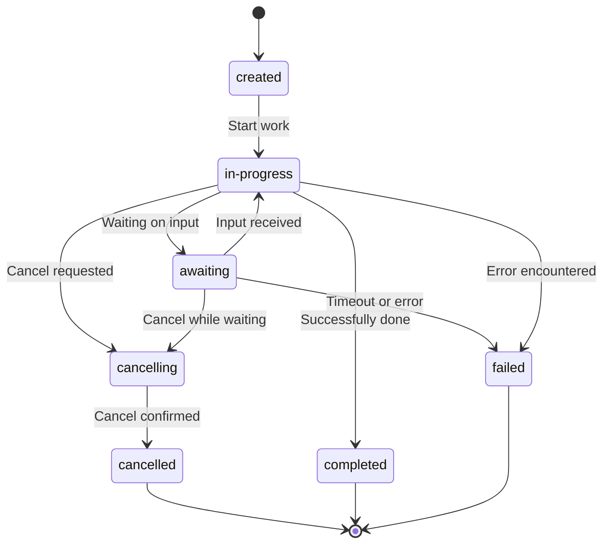

The Agent Communication Protocol (ACP) defines a structured lifecycle for individual agent runs, guiding them from creation to completion.

Understanding this lifecycle is key to effectively managing agent executions and handling the different states that runs transition through, while also allowing the agent execution to be paused to collect additional input via `Await`.

## Agent Run

Individual agent executions are managed through "Agent Runs". Each run follows a specific state machine that determines how it progresses from creation to completion.

When a run is first created, it starts in the `created` state. This initial state indicates that the run request has been accepted but processing hasn't begun yet. As soon as an agent picks up the work, it immediately transitions to the `in-progress` state.

The run can then result in a several outcomes:

1. **Successful Completion**: The agent finishes its task successfully and transitions to the `completed` state with its final output.

2. **Failed Completion**: The agent encounters an error or fails to complete its task, transitioning to the `failed` state with error details.

3. **Cancelled Execution**: The client can request cancellation of a run using the `run/{run_id}/cancel` endpoint, which transitions the run to the `cancelling` state. Once the agent confirms the cancellation, the run moves to the terminal `cancelled` state. This two-step process ensures graceful termination of agent execution.

4. **Await-based Pause**: Using the Await mechanism, agents can temporarily pause execution in the `awaiting` state to request additional information or actions from the client.

###  Agent Run Await 

Await is a core concept in ACP that enables pausing of agent execution to allow the client to provide additional input.
 
When an agent requires external data to continue its work, it can pause execution and wait for the client to supply the necessary information. This enables interactive workflows where agents can, for example:

- Request clarification or additional context
- Ask for user confirmation
- Trigger actions in other systems


The paused execution then result in these outcomes:

1. **Resumed Execution**: Once the requested information is provided by the client via the resume endpoint, the agent transitions back to `in-progress` and continues execution.
2. **Cancelled Execution**: The Await state can also be interrupted by cancellation.
3. **Timeout**: If the agent remains in the `awaiting` state for too long without receiving a response, it will transition to the `failed` state with a timeout error.

### Run States

Agent Runs transition through the following states:



### State Descriptions

- **`created`** - The run has been initiated but not yet started processing
- **`in-progress`** - The agent is actively processing the request
- **`awaiting`** - The agent has paused execution and is waiting for additional input
- **`completed`** - The agent has successfully finished processing
- **`cancelling`** - A cancellation request has been received and is being processed
- **`cancelled`** - The run has been successfully cancelled
- **`failed`** - The run encountered an error and cannot continue


## Managing Agent Runs

ACP provides specific API endpoints for managing the run lifecycle:

| **Method**               | **Endpoint**                  | **Description**                                                                                         |
|--------------------------|-------------------------------|---------------------------------------------------------------------------------------------------------|
| `POST`                   | `/runs`                       | Initiates a new agent run. Requires `agent_name`, `input`. Optional: `session_id`, `mode` (`sync`, `async`, `stream`). Returns the initial `Run` object or stream. |
| `GET`                    | `/runs/{run_id}`              | Retrieves the current state and details of a specific agent run.                                       |
| `POST`                   | `/runs/{run_id}`              | Resumes an agent run in the `awaiting` state. Requires `await_resume` data. Optional: `mode` for the response. |
| `POST`                   | `/runs/{run_id}/cancel`       | Requests cancellation of an ongoing agent run. Returns `202 Accepted` if cancellation is initiated.    |

## Execution Patterns

The ACP SDK supports several execution patterns that interact with the run lifecycle:

### Synchronous Execution

The client's `run_sync` method executes an agent and waits for the complete response:

<CodeGroup>
```python Python
run = await client.run_sync(agent="echo", input=[Message(parts=[MessagePart(content="Howdy!")])])
```

```bash cURL
curl -X POST http://localhost:8000/runs \
  -H "Content-Type: application/json" \
  -d '{
        "agent_name": "echo",
        "input": [{"role": "user", "parts": [{"content": "Howdy!"}]}],
        "mode": "sync"
      }'
```
</CodeGroup>

### Asynchronous Execution

A synchronous `POST` request to `/runs` responds with a `run_id`, which can then be queried via `/runs/{run_id}` to obtain the current state of the run. It is the client's responsibility to poll for the terminal state and the result of the run.

<CodeGroup>
```python Python
run = await client.run_async(agent="echo", input=[Message(parts=[MessagePart(content="Howdy!")])])
```

```bash cURL
curl -X POST http://localhost:8000/runs \
  -H "Content-Type: application/json" \
  -d '{
        "agent_name": "echo",
        "input": [{"role": "user", "parts": [{"content": "Howdy!"}]}],
        "mode": "async"
      }'
```
</CodeGroup>

### Streaming Execution

The `run_stream` method delivers incremental updates as the agent processes:

<CodeGroup>
```python Python
async for event in client.run_stream(agent="echo", input=[Message(parts=[MessagePart(content="Howdy!")])]):
    print(event)
```

```bash cURL
curl -X POST http://localhost:8000/runs \
  -H "Content-Type: application/json" \
  -d '{
        "agent_name": "echo",
        "input": [{"role": "user", "parts": [{"content": "Howdy!"}]}],
        "mode": "stream"
      }'
```
</CodeGroup>