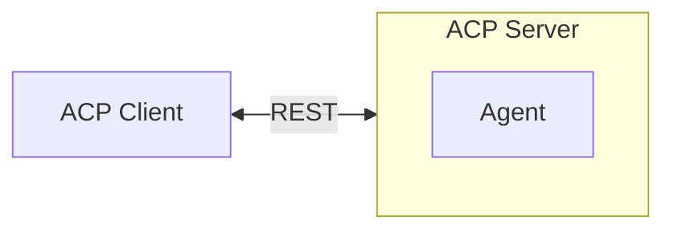
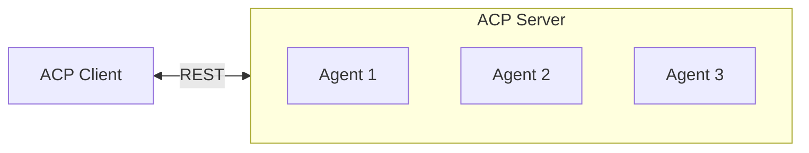
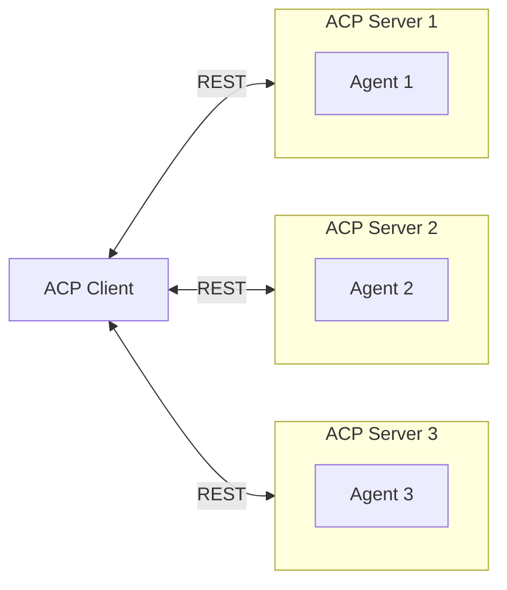
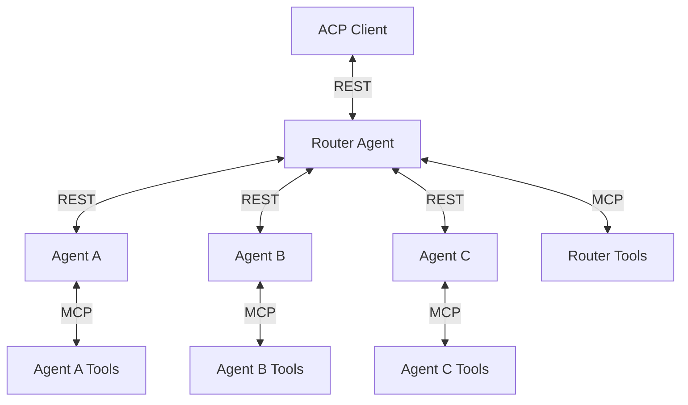

The **Agent Communication Protocol (ACP)** provides a standardized interface for agent communication, enabling seamless interaction between clients and servers, as well as between multiple agents in complex systems. This page explains the architectural patterns that ACP supports, from simple deployments to sophisticated multi-agent ecosystems.

## Core Components

An **ACP client** can be used by an ACP agent, application, or other service that makes requests to an ACP server using the ACP protocol.

An **ACP server** can be an ACP agent, microservice, or subprocess that executes requests and returns results to the client using the ACP protocol.

<Note>
ACP servers and clients can be deployed in any combination—a single process can act as both a server (handling incoming requests) and a client (making outbound requests to other agents).
</Note>

## Basic Single-Agent

The simplest ACP deployment connects a client directly to a single agent via a REST interface over HTTP. This pattern is ideal for direct communication with a single specialized agent, lightweight setups with minimal infrastructure requirements, development and debugging environments, proof-of-concept implementations.

The ACP Server wraps the agent and exposes an HTTP endpoint, translating REST calls into the agent's internal logic and returning responses in the standardized ACP format.

## Multi-Agent Single Server

An ACP Server can host multiple agents behind a single HTTP endpoint. Each agent is individually addressable through the server's routing mechanism, which uses agent metadata to determine the appropriate handler.

Benefits:
- Resource efficiency - shared server infrastructure
- Simplified deployment - single service to manage
- Centralized logging and monitoring
- Consistent authentication and authorization

When to use:
- Agents share similar resource requirements
- Related agents that benefit from co-location
- Development environments with multiple test agents

## Distributed Multi-Server Architecture

In distributed architectures, an ACP client can discover and communicate with multiple independent servers, each hosting one or more agents. This pattern enables:
- Scalability: independent scaling of different agent types, load distribution across multiple servers, fault isolation between services
- Flexibility: different deployment environments per agent,technology stack diversity, independent development and deployment cycles

## Advanced Multi-Agent Orchestration

Advanced ACP deployments support sophisticated multi-agent architectures for complex workflows. The Router Agent pattern is a common design where a central agent:

- Decomposes complex requests into specialized sub-tasks
- Routes tasks to appropriate specialist agents
- Aggregates responses into cohesive results
- Uses its own tools and those exposed by downstream agents via the **MCP extension**

<Note> 
The router pattern is one of many multi-agent designs; ACP supports flexible topologies—agents can be composed, chained, or coordinated to suit your application's needs.
</Note>