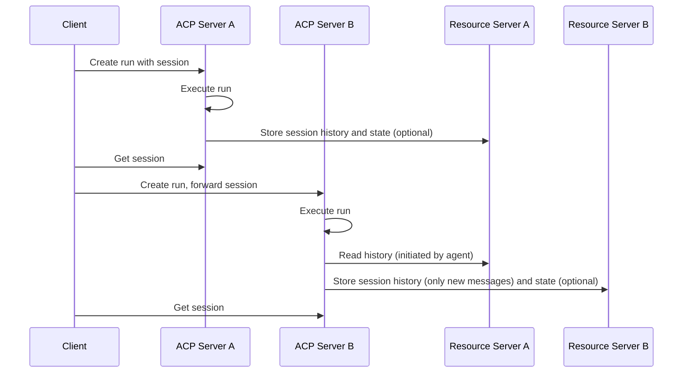

ACP enables **distributed sessions** that can span multiple independent server instances without requiring shared infrastructure. This is achieved through **session descriptors** in the protocol itself and arbitrary **resource servers** for content storage.

## Core Concept

In distributed sessions, session content is **referenced by HTTP URL** and stored on an arbitrary resource server (e.g. S3-compatible server). When a session moves between ACP servers, only the session descriptor needs to be forwarded. Therefore, each ACP server has its own version of the session, the session is distributed over all ACP servers involved.

Below is the structure of a session descriptor:

```json
{
  "id": "session-123",
  "history": [
    "http://resource-server-a/sessions/session-123/message-1",
    "http://resource-server-b/sessions/session-123/message-2"
  ],
  "state": "http://resource-server-b/sessions/session-123/state"
}
```

- **history** is a list of ACP messages (e.g. inputs and outputs of previous runs)
- **state** is an arbitrary state content stored explicitly by an agent

## Architecture Overview



## Resource Server Pattern

ACP servers delegate the storage of session history and state to arbitrary resource servers. This is similar to how the message format uses `content_url` to avoid large message parts.

This makes a session lightweight and resilient. If an ACP server goes down, the content is generally not affected as resource servers are highly available and durable. Other ACP servers and/or clients holding the session descriptor may continue in the session unaffected.

## Session Flow Example

### 1. Cross-Server Continuation
```python
async with Client() as client, client.session() as session:
        # Client creates a session on Server A
        response = await session.run_sync(
            input=[Message(role="user", parts=[...])],
            agent="chat_agent",
            base_url="http://server-a:8000"
        )
        # Client automatically forwards the session to Server B
        response = await session.run_sync(
            input=[Message(role="user", parts=[...])],
            agent="chat_agent",
            base_url="http://server-b:8001"
        )
```

### 2. History Loading
```python
@agent()
async def history_aware_agent(input: list[Message], context: Context):
    # This automatically resolves URIs from other servers
    async for message in context.session.load_history():
        yield message  # Includes messages from all servers
    
    # Process new input with full context
    for message in input:
        yield message
```

## Session Schema

Session contains URL references rather than inline content:

```python
class Session(BaseModel):
    id: UUID
    history: list[AnyHttpUrl]  # List of URLs pointing to messages
    state: AnyHttpUrl          # URL pointing to session state
```

## URL Resolution

The ACP SDK handles URL resolution transparently:

1. **Session Loading**: When `context.session.load_history()` generator is called, the SDK identifies URL references
2. **HTTP Requests**: The SDK makes HTTP GET requests to fetch content from resource servers
3. **Content Parsing**: Retrieved content is parsed into Message objects
4. **Caching**: Frequently accessed content may be cached locally to reduce network calls

## Session API Endpoints

Each ACP server exposes session endpoint for reading the session descriptor:

```
GET /sessions/{session_id}
```

## Resource API Endpoints

If resource forwarding is enabled, it also exposes resources:

```
GET /resources/{resource_id}
```

These endpoints allow other servers to fetch session content from resource storage that doesn't implement HTTP or is not reachable over the network directly.

## Benefits

**No Shared Infrastructure**
- Servers operate independently without shared databases or message queues
- Standard HTTP communication between servers
- Each server manages its own resources and scaling

**Fault Tolerance** 
- Sessions can continue even if some servers become unavailable
- Graceful degradation when historical content is unreachable
- No single point of failure for session storage

**Scalability**
- Horizontal scaling without coordination overhead
- Servers can be added or removed independently
- Network-based load distribution

**Flexibility**
- Mix and match different server implementations
- Servers can specialize in different agent types
- Geographic distribution of servers possible

## Message Parts Integration

Distributed sessions leverage ACP's existing content delivery mechanisms. Messages can contain either:
- `content`: Inline data stored locally on the current server
- `content_url`: URL reference to content on another server

```json
{
  "role": "agent/assistant",
  "parts": [
    {
      "content_type": "text/plain",
      "content_url": "http://resource-server/very-large-text"
    }
  ]
}
```

## Considerations

**Network Latency**
- Cross-server content fetching introduces network latency
- Consider geographic proximity of servers for better performance
- Local caching can mitigate repeated requests

**Server Availability**
- Historical content becomes unavailable if source servers go offline
- Design agents to handle missing historical context gracefully
- Consider replication strategies for critical session data

**Authentication**
- Servers may need authentication to access each other's content
- Implement appropriate security measures for cross-server communication
- Consider network security for server-to-server communication

For implementation details and deployment patterns, see the [High Availability guide](/how-to/high-availability).