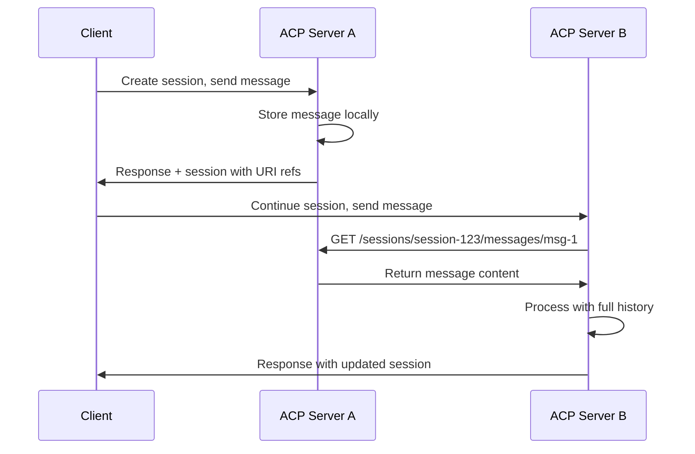

ACP enables **distributed sessions** that can span multiple independent server instances without requiring shared infrastructure. This is achieved through URI-based session references where servers act as resource servers for each other.

## Core Concept

In distributed sessions, session data is **referenced by URI** rather than stored inline. When a session moves between servers, the session history contains URLs pointing to content on other servers rather than the actual content.

```json
{
  "id": "session-123",
  "history": [
    "http://server-a:8000/sessions/session-123/messages/msg-1",
    "http://server-b:8001/sessions/session-123/messages/msg-2"
  ],
  "state": "http://server-a:8000/sessions/session-123/state"
}
```

## Architecture Overview



## Resource Server Pattern

Each ACP server functions as both:
- **Client**: Consuming sessions and fetching content from other servers
- **Resource Server**: Serving session content to other servers via HTTP

When an agent needs session history from another server, it uses the `content_url` mechanism to fetch the actual message content:

```python
# Message part with content URL instead of inline content
MessagePart(
    content_type="text/plain",
    content_url="http://server-a:8000/sessions/session-123/messages/msg-1"
)
```

## Session Flow Example

### 1. Session Creation
```python
# Client creates session on Server A
async with Client("http://server-a:8000") as client:
    async with client.session() as session:
        response = await session.run_sync(
            input=[Message(role="user", parts=[...])],
            agent="chat_agent"
        )
```

### 2. Cross-Server Continuation
```python
# Client continues same session on Server B
async with Client("http://server-b:8001") as client:
    async with client.session(session_id) as session:
        # Server B automatically fetches history from Server A
        response = await session.run_sync(
            input=[Message(role="user", parts=[...])],
            agent="chat_agent"
        )
```

### 3. History Loading
```python
@agent()
async def history_aware_agent(input: list[Message], context: Context):
    # This automatically resolves URIs from other servers
    async for message in context.session.load_history():
        yield message  # Includes messages from all servers
    
    # Process new input with full context
    for message in input:
        yield message
```

## Session Schema

Sessions contain URI references rather than inline content:

```python
class Session(BaseModel):
    id: str
    history: list[str]  # List of URIs pointing to messages
    state: str          # URI pointing to session state
```

## URI Resolution

The ACP SDK handles URI resolution transparently:

1. **Session Loading**: When `context.session.load_history()` is called, the SDK identifies URI references
2. **HTTP Requests**: The SDK makes HTTP GET requests to fetch content from resource servers
3. **Content Assembly**: Retrieved content is assembled into complete Message objects
4. **Caching**: Frequently accessed content may be cached locally to reduce network calls

## Session API Endpoints

Each ACP server exposes endpoints for resource server functionality:

```
GET /sessions/{session_id}
GET /sessions/{session_id}/messages/{message_id}  
GET /sessions/{session_id}/state
```

These endpoints allow other servers to fetch session data as needed.

## Benefits

**No Shared Infrastructure**
- Servers operate independently without shared databases or message queues
- Standard HTTP communication between servers
- Each server manages its own resources and scaling

**Fault Tolerance** 
- Sessions can continue even if some servers become unavailable
- Graceful degradation when historical content is unreachable
- No single point of failure for session storage

**Scalability**
- Horizontal scaling without coordination overhead
- Servers can be added or removed independently
- Network-based load distribution

**Flexibility**
- Mix and match different server implementations
- Servers can specialize in different agent types
- Geographic distribution of servers possible

## Message Parts Integration

Distributed sessions leverage ACP's existing content delivery mechanisms. Messages can contain either:
- `content`: Inline data stored locally on the current server
- `content_url`: URI reference to content on another server

```json
{
  "role": "agent/assistant",
  "parts": [
    {
      "content_type": "text/plain",
      "content_url": "http://server-a:8000/sessions/session-123/messages/msg-1"
    }
  ]
}
```

The ACP SDK automatically resolves these URLs when loading session history, making the distribution transparent to both agents and client applications.

## Considerations

**Network Latency**
- Cross-server content fetching introduces network latency
- Consider geographic proximity of servers for better performance
- Local caching can mitigate repeated requests

**Server Availability**
- Historical content becomes unavailable if source servers go offline
- Design agents to handle missing historical context gracefully
- Consider replication strategies for critical session data

**Authentication**
- Servers may need authentication to access each other's content
- Implement appropriate security measures for cross-server communication
- Consider network security for server-to-server communication

For implementation details and deployment patterns, see the [High Availability guide](/how-to/high-availability).